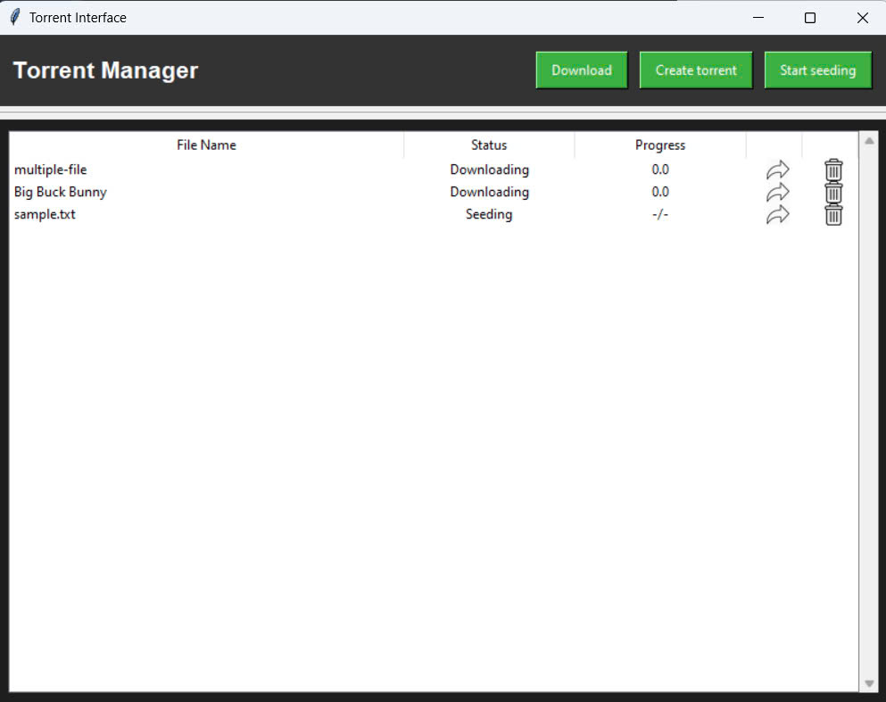
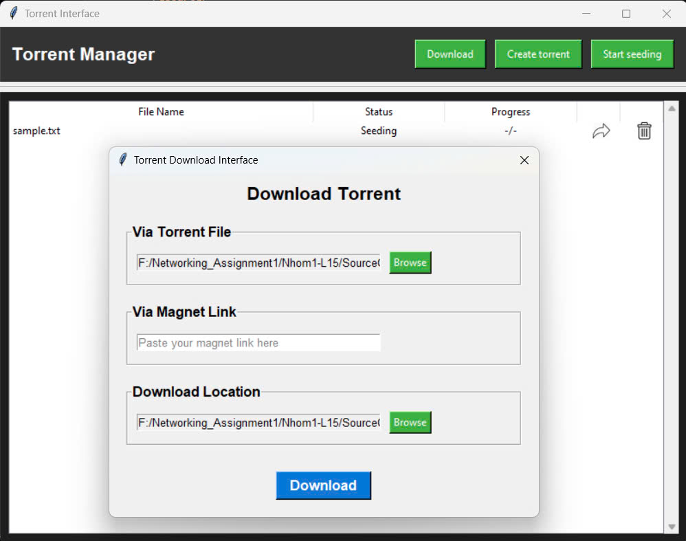

# Torrent Client

A simple torrent client for downloading, seeding, and managing torrent files.

## Requirements

- Python version 3.12
- Install packages in `requirements.txt`

## How to use

### Commands:

#### download
Download a torrent file.

**Arguments:**
- `torrent_file` (str): Path to the torrent file.
- `--port` (int): Port to use for downloading (default: 6881).
- `--download-dir` (str): Directory to save the downloaded file.

#### download_magnet
Download a torrent using a magnet link.

**Arguments:**
- `magnet_link` (str): Magnet link to download the torrent.
- `--download-dir` (str): Directory to save the downloaded file.

#### seed
Seed a torrent file.

**Arguments:**
- `torrent_file` (str): Path to the torrent file.
- `complete_file` (str): Path to the complete file to seed.
- `--port` (int): Port to use for seeding (default: 6882).

#### status
Show the status of the torrent client.

#### peers
Manage peers for a torrent file.

**Arguments:**
- `torrent_file` (str): Path to the torrent file.
- `--scrape` (bool): Scrape the tracker for peer information.
- `--get` (bool): Get the list of peers from the tracker.

#### stop
Stop a seeding torrent file.

**Arguments:**
- `torrent_file` (str): Path to the torrent file.

#### create
Create a new torrent file.

**Arguments:**
- `input_path` (str): Path to the file or directory to include in the torrent.
- `--tracker` (str): Tracker address (required).
- `--output` (str): Output torrent file name (default: 'output.torrent').
- `--piece-length` (int): Piece length in bytes (default: 524288).
- `--magnet` (bool): Generate magnet link.

## Option --gui 
Supported interface to easily track torrent files, seeding or downloading, and operate on them.

### GUI Interfaces

#### Login Interface

#### Treeview Interface

#### Download Interface
